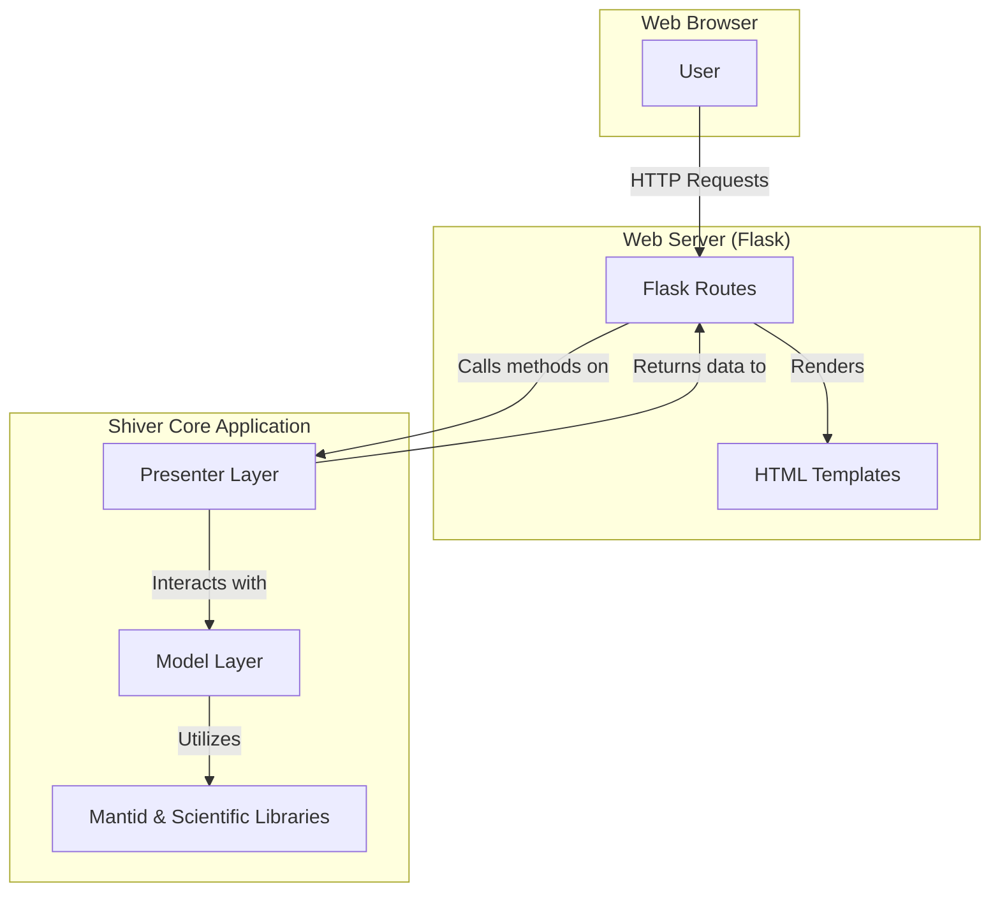

# Shiver Web Application

This document outlines the Flask-based web interface for the Shiver application. This new view layer provides a modern, web-accessible alternative to the original PyQt GUI, while reusing the existing MVP (Model-View-Presenter) architecture.

## High-Level Design

The web application is designed as a new "View" component that interacts with the existing Presenter and Model layers of the Shiver application. This approach allows for maximum code reuse and ensures that the core scientific logic remains unchanged.



**Key Components:**

*   **Flask Routes (`app.py`):** These are the entry points for all web requests. They handle user input, call the appropriate methods on the Presenter layer, and render the HTML templates.
*   **HTML Templates (`templates/`):** These files define the structure and layout of the web pages. They are rendered by Flask, which populates them with data from the Presenter.
*   **Presenter Layer:** The existing Presenter classes are used to orchestrate the application's logic. A "dummy" view object is used to satisfy the Presenter's constructor, but the core logic remains the same.
*   **Model Layer:** The existing Model classes, which contain the core scientific logic and data handling, are used without modification.

## Installation

To run the web application, you will need to create a conda environment from the provided `environment.yml` file. This will ensure you have all the necessary dependencies for both the core application and the new web interface.

1.  **Create the Conda Environment:**
    If you have conda installed, you can create the environment using the following command:
    ```bash
    conda env create -f environment.yml
    ```

2.  **Activate the Environment:**
    Once the environment is created, you will need to activate it before running the application:
    ```bash
    conda activate shiver
    ```

## Usage

A shell script has been provided to easily start the web application.

1.  **Make the script executable (if you haven't already):**
    ```bash
    chmod +x start_web.sh
    ```

2.  **Run the script:**
    ```bash
    ./start_web.sh [port]
    ```
    *   You can optionally provide a port number as an argument. If no port is provided, it will default to `5000`.
    *   Example: `./start_web.sh 8080`

3.  **Access the application:**
    Open your web browser and navigate to `http://127.0.0.1:5000` (or the custom port you specified).

## Features

The web interface provides access to the following Shiver features:

*   **Configuration:** View and modify application settings.
*   **Sample:** Set up sample parameters and load UB matrices.
*   **Generate:** Generate MDE workspaces from raw data.
*   **Histogram:** Create histograms (slices) from MDE workspaces and view the resulting plots.
*   **Refine UB:** A simplified, non-interactive view for UB matrix refinement.
*   **Polarized Options:** Set parameters for polarized neutron scattering experiments.
*   **Help:** A summary of the application's features with a link to the full documentation.

## Dark Mode

The web interface includes a dark mode toggle in the navigation bar. Your preference will be saved in your browser's local storage and will persist across sessions.
