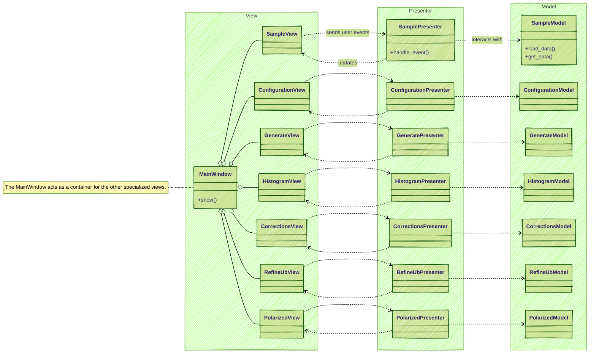

## Key Design Points:

   * Separation of Concerns: The code is organized into three distinct layers (models, views, presenters), which is a strong indicator of an MVP or similar pattern.
   * MainWindow as Container: The MainWindow likely assembles the various smaller, specialized UI components (SampleView, ConfigurationView, etc.).
   * Presenter as Mediator: Each View communicates with a corresponding Presenter. The Presenter contains the application logic, interacts with the Model to fetch or
     modify data, and then updates the View to reflect any changes.
   * Data Flow: User actions in the View trigger methods in the Presenter. The Presenter then uses the Model to handle the logic and data manipulation. Finally, the
     Presenter calls methods in the View to update the display.

